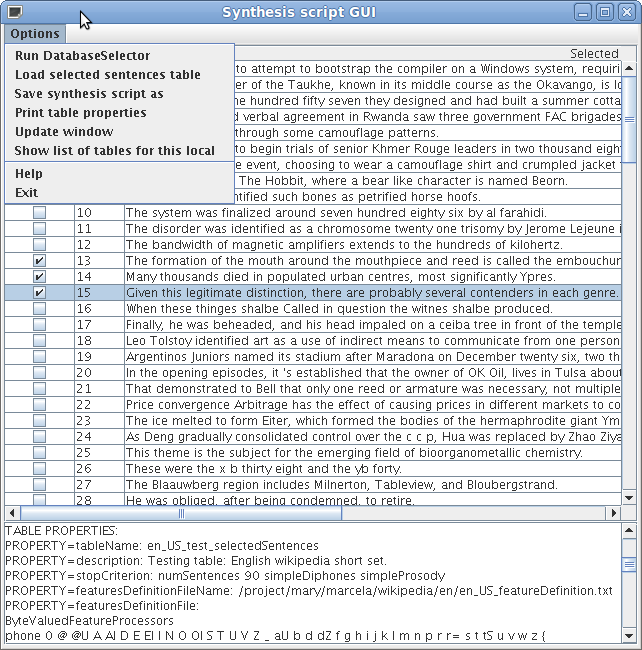
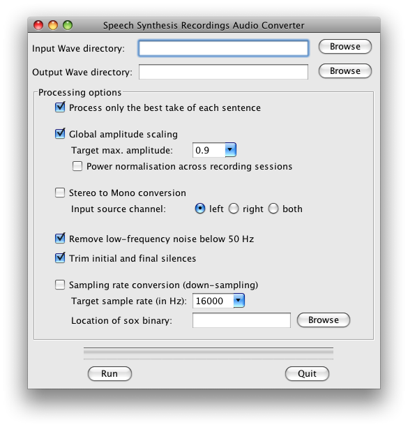

# Adding support for a new language to MARY TTS
This page outlines the steps necessary to add support for a new language to MARY TTS 5.

The following picture outlines the overall process.

The following sections describe the various steps involved.

# 0. Set up your environment

## 0.1 Compile marytts builder tools

First make sure you have built the MARY TTS software from source, using `mvn install` as described in the README. All software required for building the voice should now be located below

    marytts/target/marytts-builder-<version>/

with all shell scripts used in this page located in 

    marytts/target/marytts-builder-<version>/bin/

So please either place that folder into your `$PATH` or prefix each call to a shell script with `marytts/target/marytts-builder-<version>/bin/`.

## 0.2 Create a wiki data directory

Create an empty directory as your wiki data directory.

In your wiki data directory run the `wkdb_setup.sh` with the appropriate parameters,

    $ wkdb_setup.sh [wkdb data path] [wkdb locale] [mary locale]

where

    wkdb data path: path for the wkdb data path a configuration file will be create
    wkdb locale: the two letter locale for your language (e.g.: en, de, te, it, ...)
    mary locale: the extended mary locale for your language (e.g.: en_US, en_GB, de, te, it, ...)

e.g.:

    $ wkdb_setup.sh ./ en en_US
    (i.e., 
    $ marytts/target/marytts-builder-<VERSION>/bin/wkdb_setup.sh ./ en en_US
    )

This creates a config file `wkdb.conf` (Please look at the configuration file `wkdb.conf` and change it according to your needs)

# 1. Download xml dump of wikipedia in your language

  Information about where and how to download the wikipedia in several languages is in: http://en.wikipedia.org/wiki/Wikipedia_database

  for example:

* English xml dump of wikipedia available at : http://download.wikimedia.org/enwiki/latest/ ( example file: enwiki-latest-pages-articles.xml.bz2 4.1 GB )
* Telugu xml dump of wikipedia available at : http://download.wikimedia.org/tewiki/latest/

The following script should automate the download and unpacking of the wikipedia dump for your language.

    $ wkdb_download_wikidump.sh wkdb.conf 

## 2. Extract clean text and most frequent words

### 2.1. Split the xml dump

Once downloaded the best way to handle the xml dump is splitting it into small chunks. You can avoid this step if your wiki dump is not bigger than 500MB, and you do not have memory problems.

For example, after unziping the English wikipedia dump will be approx. 16GB, so for further processing it can be split using the Wikipedia Dump Splitter program, wrapped by the following script:
 
    $ wkdb_split_dump.sh wkdb.conf 

This should create a file `wikilist.txt` which should contain something like:

    /current-dir/xml_splits/page1.xml
    /current-dir/xml_splits/page2.xml
    /current-dir/xml_splits/page3.xml
    ...

*NOTE:* If you experience memory problems you can try to split the big xml dump in smaller chunks.

### 2.2. Wikipedia Markup cleaning and mysql database creation

The next step will be to extract clean text (without wikipedia markup) from the split xml files and save this text and a list of words in a mysql database.

First of all a mysql database should be created with all privileges. In ubuntu if you have mysql server installed a database can be created with:

    $ wkdb_create_database.sh wkdb.conf

If you do not have rights for creating a mysql database, please contact your system administrator for creating one for you.

Once you have a mysql database, you can start to extract clean text and words from the wikipedia split files using the `WikipediaProcessor` program:

    $ wkdb_cleaning_up.sh wkdb.conf

*Output:*

- It creates a file `./done.txt` which contains the files already processed, in case the program stops it can be re-started and it will continue processing the not "done" files in the input list.

- A text file `./wordlist-freq.txt` containing the list of words and their frequencies, this file will be created after processing each xml file.

- It creates two tables in the the database, the name of the tables depends on the locale, for example if the locale is "en_US" it will create the tables `en_US_cleanText` and `en_US_wordList`, their description is:

        mysql> desc en_US_cleanText;
        +-----------+------------------+------+-----+---------+----------------+
        | Field     | Type             | Null | Key | Default | Extra          |
        +-----------+------------------+------+-----+---------+----------------+
        | id        | int(10) unsigned | NO   | PRI | NULL    | auto_increment |
        | cleanText | mediumblob       | NO   |     |         |                |
        | processed | tinyint(1)       | YES  |     | NULL    |                |
        | page_id   | int(10) unsigned | NO   |     |         |                |
        | text_id   | int(10) unsigned | NO   |     |         |                |
        +-----------+------------------+------+-----+---------+----------------+

        mysql> desc en_US_wordList;
        +-----------+------------------+------+-----+---------+----------------+
        | Field     | Type             | Null | Key | Default | Extra          |
        +-----------+------------------+------+-----+---------+----------------+
        | id        | int(11)          | NO   | PRI | NULL    | auto_increment |
        | word      | tinyblob         | NO   |     |         |                |
        | frequency | int(10) unsigned | NO   |     |         |                |
        +-----------+------------------+------+-----+---------+----------------+

## 3. Transcribe most frequent words

  Transcribe most frequent words using MARY Transcription Tool. Transcription Tool is a graphical user interface which supports a semi-automatic procedure for transcribing new language text corpus and automatic training of Letter-to-sound(LTS) rules for that language. It stores all functional words in that language to build a primitive POS tagger.

  Create pronunciation dictionary,  train letter-to-sound rules and prepare list of functional words for primitive POS tagger using MARY Transcription Tool.

    $ transcription.sh 

  More details available at https://mary.opendfki.de/trac/wiki/TranscriptionTool

## 4. Minimal NLP components for the new language

With the files generated by the Transcription tool, we can now create a first instance of the NLP components in the TTS system for our language.

The easiest way to do this is probably to copy one of the existing language projects with minimal NLP components (e.g., `marytts-lang-tr`, `marytts-lang-te` or `marytts-lang-ru`). Assuming we want to build NLP support for locale `xy`, we would copy the entire subfolder:

    $ cd marytts/marrytts-languages
    $ cp -r marytts-lang-tr marytts-lang-xy
    $ cd marytts-lang-xy
    $ rm target .project .classpath # these are generated files

Now the key files to edit will be the following.

* the maven project file

        marytts-lang-xy/pom.xml

* From transcription tool, copy source files for future reference:

        marytts-lang-xy/lib/modules/xy/lexicon/allophones.xy.xml
        marytts-lang-xy/lib/modules/xy/lexicon/xy.txt

* Copy runtime files from the transcription tool:

        marytts-lang-xy/src/main/resources/marytts/language/xy/lexicon/allophones.xy.xml
        marytts-lang-xy/src/main/resources/marytts/language/xy/lexicon/xy.lts
        marytts-lang-xy/src/main/resources/marytts/language/xy/lexicon/xy_lexicon.fst
        marytts-lang-xy/src/main/resources/marytts/language/xy/tagger/xy_pos.fst

* Create a default text for your language:

        marytts-lang-xy/src/main/resources/marytts/language/xy/datatypes/TEXT.xy.example

* The config file is the heart of your new language support. Copy from other language, edit carefully:

        marytts-lang-xy/src/main/resources/marytts/language/xy/xy.config

* As a minimal java file, all you need is a config loader -- copy from other language and edit:

        marytts-lang-xy/src/main/java/marytts/language/xy/XYConfig.java

* Some minimal unit tests to verify that the config sets locales correctly -- copy and edit:

        marytts-lang-xy/src/test/java/marytts/language/xy/XYConfigTest.java

* Refer to the new config loader so that MARY TTS can find it:

        marytts-lang-xy/src/main/resources/META-INF/services/marytts.config.MaryConfig

Once these are all in place and look right, try to build the new language file:

    $ cd marytts-lang-xy
    $ mvn test

When that works, add the language project as a new subproject into the master pom:

    marytts/pom.xml

include it as a dependency in the assembly-plugin:

    marytts/marytts-assembly/assembly-runtime/pom.xml

and build the full project:

    $ cd marytts
    $ mvn install

If that goes well, it should be possible to start the marytts server:

    $ marytts/target/marytts-<version>/bin/marytts-server.sh

To test the system manually, place a query via the HTTP interface, for input format TEXT, locale xy, and output formats up to TARGETFEATURES. A suitable test request can be placed from http://localhost:59125/documentation.html. It is a good idea to check whether the output for TOKENS, PARTSOFSPEECH, PHONEMES, INTONATION and ALLOPHONES looks roughly as expected.

In order to continue with the next step, you will need to have a marytts system with this locale operational, so that the FeatureMaker can compute feature vectors for computing diphone coverage.

## 5. Run feature maker with the minimal NLP components

The *FeatureMaker* program splits the clean text obtained in step 2 into sentences, classifying them as reliable or non-reliable (sentences with unknown words or strange symbols) and extracts context features from the reliable sentences. All this extracted data will be  kept in the DB.

To run the feature maker, you *must* have the new language components available in `marytts/target/marytts-<version>/` as described in the previous step. DO NOT TRY TO PROCEED before having achieved step 4.

    $ wkdb_featuremaker.sh wkdb.conf 

(There is a variant of the program, *FeatureMakerMaryServer*, which calls an external Mary server instead of starting the Mary components internally. It takes the additional command line arguments `-maryHost localhost -maryPort 59125`. Adapt the above script if you need to use this for some reason.)

Output:

- After processing every cleanText record it will mark the record as processed=true, so if the program stops it can be re-started and it will continue processing the non-processed cleanText records.

- A file containing the feature definition of the features used for selection, the name of this file depends on the locale, for example for "en_US" it will be `/current-dir/en_US_featureDefinition.txt`. This file will be used in the Database selection step.

- It creates one table in the the database, the name of the table depends on the locale, for example if the locale is "en_US" it will create the table `en_US_dbselection`, its descriptions is:

        mysql> desc en_US_dbselection;
        +----------------+------------------+------+-----+---------+----------------+
        | Field          | Type             | Null | Key | Default | Extra          |
        +----------------+------------------+------+-----+---------+----------------+
        | id             | int(11)          | NO   | PRI | NULL    | auto_increment | 
        | sentence       | mediumblob       | NO   |     |         |                | 
        | features       | blob             | YES  |     | NULL    |                | 
        | reliable       | tinyint(1)       | YES  |     | NULL    |                | 
        | unknownWords   | tinyint(1)       | YES  |     | NULL    |                | 
        | strangeSymbols | tinyint(1)       | YES  |     | NULL    |                | 
        | selected       | tinyint(1)       | YES  |     | NULL    |                | 
        | unwanted       | tinyint(1)       | YES  |     | NULL    |                | 
        | cleanText_id   | int(10) unsigned | NO   |     |         |                | 
        +----------------+------------------+------+-----+---------+----------------+

## 6. Database selection

The *DatabaseSelector* program selects a phonetically/prosodically balanced recording script. It can be run through the following shell script:

    $ wkdb_database_selector.sh wkdb.conf 

*Output:*

- Several log information in `/current-dir/selection/` directory

- A file containing the selected sentences in `/current-dir/selected.log`

- The id's of the selected sentences are marked as `selected=true` in `dbselection`

- It creates a `locale_***_selectedSentences` table in the the database. The name of the table depends on the locale, and the name provided by the user with the option `-tableName`,  for example if the user provided `-tableName "Test"` and the locale is "en_US" it will create the table:

        mysql> desc en_US_Test_selectedSentences;
        +----------------+------------------+------+-----+---------+----------------+
        | Field          | Type             | Null | Key | Default | Extra          |
        +----------------+------------------+------+-----+---------+----------------+
        | id             | int(11)          | NO   | PRI | NULL    | auto_increment | 
        | sentence       | mediumblob       | NO   |     |         |                | 
        | unwanted       | tinyint(1)       | YES  |     | NULL    |                | 
        | dbselection_id | int(10) unsigned | NO   |     |         |                | 
        +----------------+------------------+------+-----+---------+----------------+

Also a description of this table will be set in the `tablesDescription` table.

The `tablesDescription` has information about:

    mysql> desc tablesDescription;
    +----------------------------+------------+------+-----+---------+----------------+
    | Field                      | Type       | Null | Key | Default | Extra          |
    +----------------------------+------------+------+-----+---------+----------------+
    | id                         | int(11)    | NO   | PRI | NULL    | auto_increment | 
    | name                       | tinytext   | YES  |     | NULL    |                | 
    | description                | mediumtext | YES  |     | NULL    |                | 
    | stopCriterion              | tinytext   | YES  |     | NULL    |                | 
    | featuresDefinitionFileName | tinytext   | YES  |     | NULL    |                | 
    | featuresDefinitionFile     | mediumtext | YES  |     | NULL    |                | 
    | covDefConfigFileName       | tinytext   | YES  |     | NULL    |                | 
    | covDefConfigFile           | mediumtext | YES  |     | NULL    |                | 
    +----------------------------+------------+------+-----+---------+----------------+

## 7. Manually check/correct transcription of all words in the recording script [Optional]

The *SynthesisScriptGUI* program allows you to check the sentences selected in the previous step, discard some (or all) and select and add more sentences.

The following script can be used to start the GUI:

    $ wkdb_synthesis_script_GUI.sh wkdb.conf 

Synthesis script menu options:

* `Run DatabaseSelector`: Creates a new selection table or adds sentences to an already existing one.

  * After running the DatabaseSelector the selected sentences are loaded.

* `Load selected sentences table`: reads mysql parameters and load a selected sentences table.

  * Once the sentences are loaded, use the checkboxes to mark sentences as unwanted/wanted.
  * Sentences marked as unwanted can be unselected and set as wanted again.
  * The DB is updated every time a checkbox is selected.
  * There is no need to save changes. Changes can be made before the window is updated or the program exits.

* `Save synthesis script as`: saves the selected sentences, without unwanted, in a file.

* `Print table properties`: prints the properties used to generate the list of sentences.

* `Update window`: presents the table without the sentences marked as unwanted.

* `Help`: presents this description.

* `Exit`: terminates the program.

## 8. Record script with a native speaker using our recording tool "Redstart"

In the recording tool Redstart, there is an import functionality for the text files generated from the synthesis script selection GUI. From the Redstart menu, select "File"->"Import text file..." and follow the on-screen instructions.

More information: [RedStart: Voice recording tool for TTS](https://mary.opendfki.de/trac/wiki/RedStart)

## 9. Convert recorded audio
Usually it makes sense to convert the audio recorded from the speaker before building a synthetic voice from it. MARY TTS provides a GUI that provides a range or processing options. It can be started as follows:

    $ audio_converter_GUI.sh

The following options are provided:

 * Process only the best take of each sentence: Redstart saves various takes of the same sentence under names such as w0001.wav, w0001a.wav, w0001b.wav etc. If this option is selected, only the last recorded version, w0001.wav, will be processed.
 * Global amplitude scaling allows you to control the maximum amplitude of the converted files, independently of the recording amplitude. Power normalisation across recording sessions attempts to identify recording sessions by the time stamps of files: a pause longer than 10 minutes indicates a session break. For each session separately, a mean energy is computed, and conversion factors for each file are computed such that after the conversion, the average energy for all sessions is the same. The aim behind this processing is to compensate for the case that from one session to another, there may have been slightly different recording gains or minor differences in the speaker's distance to the microphone. Attention: This method can work only if the audio files have the original time stamps of the recordings, so take extra care when copying files if you intend to use this normalisation.
 * Stereo to mono conversion: If you recorded in stereo, you must convert to mono before building a voice. Choose either the left channel only, the right channel only, or a mix of both channels.
 * Remove low-frequency noise below 50 Hz: this applies a high-pass FIR filter with a cutoff frequency of 50 Hz and a transition bandwidth of 40 Hz. Since the FIR filter has a symmetric kernel, it has a linear phase response.
 * Trim initial and final silences: this applies a k-means clustering to identify silence vs. speech portions of the audio file, leaving 0.5 seconds initial and final silence. This is useful to avoid training absurdly long pause duration models.
 * If a sox binary is available, it is also possible to convert the sampling rate. A usual target rate is 16000 Hz, but other rates are also possible.

## 10. Build an unit selection and/or hmm-based voice with Voice import tools

See:

 * https://github.com/marytts/marytts/wiki/VoiceImportToolsTutorial
 * https://github.com/marytts/marytts/wiki/UnitSelectionVoiceCreation
 * https://github.com/marytts/marytts/wiki/HMMVoiceCreation
 